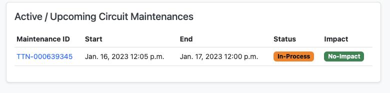

# Netbox Circuit Maintenance Plugin

Documentation: [https://jasonyates.github.io/netbox-circuitmaintenance/](https://jasonyates.github.io/netbox-circuitmaintenance/)

A NetBox plugin built to track circuit maintenance events, the plugin itself is agnostic in that it is only built to store data surrounding maintenance events and provide an overview of historical, active and upcoming circuit and provider maintenance events. The plugin tracks maintenance events at the provider level and associates impact from each event at the circuit level.

The plugin does not directly provide an automated approach to ingesting provider notifications, instead it extends NetBox's extensive REST API and provides GET/POST/PUT/PATCH methods to manage maintenance events. The plugin is intended to be coupled with an automated parser to handle the parsing of provider notifications and the delivery of the maintenance events to the plugin's REST API. Several example parsers have been documented [here](https://jasonyates.github.io/netbox-circuitmaintenance/parsers/).

## Features

 - Track provider maintenance events
 - Track circuit impact from provider maintenance
 - Provides a consolidated view of active, upcoming and historical maintenance events at the provider and circuit level
 - Consolidated notifications (coming soon)
 - Maintenance overlap detection (coming soon)

## Compatibility
This plugin is only supported on NetBox 3.4 or higher, for exact compatibility information, see the table below.  
| NetBox Version | Plugin Version |
|--|--|
| 4.2+ | 0.5.0 |
| 4.0+ | 0.4.2 |
| 3.5 | 0.3.0 |
| 3.4 | 0.2.2 |


## Installing

A working installation of Netbox 3.4+ is required - [see official documentation](https://netbox.readthedocs.io/en/stable/plugins/).

### Package Installation

Activate your virtual env and install via pip::

```bash
$ source /opt/netbox/venv/bin/activate
(venv) $ pip install netbox-circuitmaintenance
```

To ensure the Netbox Documents plugin is automatically re-installed during future upgrades, add the package to your `local_requirements.txt` :

```bash
# echo netbox-circuitmaintenance >> local_requirements.txt
```

### Enable the Plugin

In the Netbox `configuration.py` configuration file add or update the PLUGINS parameter, adding `netbox_circuitmaintenance`:


```python
PLUGINS = [
    'netbox_circuitmaintenance'
]

PLUGINS_CONFIG = {
    "netbox_circuitmaintenance": {},
}
```

### Apply Database Migrations

Apply database migrations with Netbox `manage.py`:

```
(venv) $ python manage.py migrate
```

### Restart Netbox

Restart the Netbox service to apply changes:

```
sudo systemctl restart netbox
```

## Screenshots





## Credits

Based on the NetBox plugin tutorial:

- [demo repository](https://github.com/netbox-community/netbox-plugin-demo)
- [tutorial](https://github.com/netbox-community/netbox-plugin-tutorial)

This package was created with [Cookiecutter](https://github.com/audreyr/cookiecutter) and the [`netbox-community/cookiecutter-netbox-plugin`](https://github.com/netbox-community/cookiecutter-netbox-plugin) project template.
