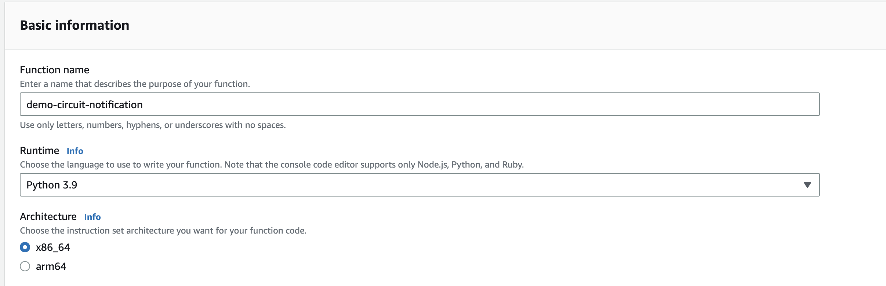
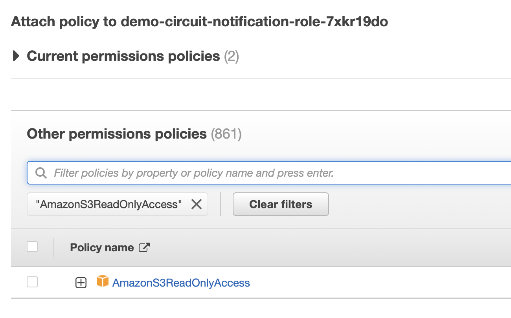
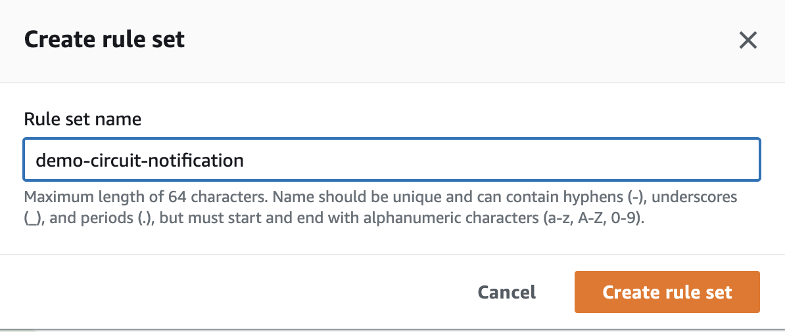
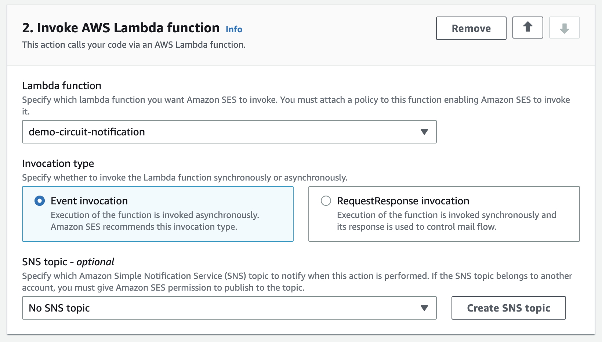

This parser leverages a server-less design for near-realtime processing of provider notifications via AWS Simple Email Service, S3 & Lambda to receive, parse and push maintenance events to NetBox. 

Pricing for the deployment will vary based on the volume of emails processed per month however in testing it is feasible to operate this solution for under $1/mo with less than 1000 emails/mo.

## Requirements

Amazon AWS Simple Email Service
Amazon AWS Lambda
Amazon AWS S3
Connectivity from your VPC hosting the Lambda function to Netbox.

**Note:** The basic setup of verifying your domain and publishing MX records to allow SES to receive email on behalf of your domain is not covered in this guide, please see [Setting up Amazon SES email receiving](https://docs.aws.amazon.com/ses/latest/dg/receiving-email-setting-up.html).

**Note**: Your Lambda function either needs to be in the same VPC as Netbox, have connectivity to Netbox over the internet, or have private connectivity to Netbox via Direct Connect etc.

**Note**: You will need to inform any relevant circuit providers to send maintenance notifications to the email address you configure to be processed by SES. This guide does not cover that process.

## Flow Diagram


1. Provider sends email notification to email address configured for receiving email in AWS SES
2. SES stores the raw email as S3 object
3. SES triggers Lambda function and passes email headers
4. Lambda function retrieves raw email from S3, performs validation of the provider and parses it using circuit_maintenance_parser
5. Maintenance event is passed to NetBox for storage and further processing 

## AWS Setup

The following steps will guide you through creating a Lambda function, giving it permission to read from an S3 bucket along with VPC access (if required), creating the SES rules to pass emails to Lambda and the creation of an S3 bucket to store incoming email.

**Step 1** - Navigate to **Lambda** -> **Create Function** to create a new Lambda function to host the email parser.
1. Enter a name for the Lambda function & select **Python 3.9** as the runtime.

2. Under Advanced Settings, enable **VPC access.** *(If required)*
3. Select the VPC, 2 or more relevant subnets from your VPC and an appropriate security group.
4. Click **Create function**
5. Once created, navigate to **Configuration** -> **Permissions** to find the IAM role that was automatically created. Click the role name to launch the IAM tool.
6. Navigate to **Add Permissions** -> **Attach Policies** and select *AmazonS3ReadOnlyAccess* and click **Attach Policy**



**Step 2** - Navigate to **Simple Email Service** -> **Email receiving** and create a rule set.



1. Within the rule set you just created, create a **new rule**.
2. Enter a name for the rule, ensure it is Enabled. Leave security options as default.
3. **Add new recipient condition** - enter the email address you wish to use to receive email. You must have previously verified your domain with SES and setup MX records.
4. **Add new action** -> **Deliver to S3 bucket**. You can specify an existing bucket or have SES create a new one for you.
5.  **Add new action** -> **Invoke AWS Lambda function**. Select the Lambda function you created in Step 1. Ensure invocation type is set to *Event Invocation* which will trigger the Lambda function as each email is received.

6. Click **Next** followed by **Create Rule**. Allow AWS to create the relevant IAM permissions for SES to access the Lambda function.

**Step 3** - Update S3 bucket to disable public access *(if required)*

If you allowed SES to create the S3 bucket automatically, it creates the bucket with public access enabled, this is not recommended or required for this deployment and should be disabled.

1. Navigate to **S3** -> Select your bucket that was created.
2. Click Permissions and under Block Public Access select **Edit**.

3. Select **Block all public access** & **Save Changes**


## Lambda Deployment

Due to how Lambda operates in an ephemeral environment, there is no means to install packages from pip on each invocation of the Lambda function, as a result you have to build the Lambda function locally and create a zip file containing the function and all required python modules. The following steps will guide you through configuring the python script for your environment, building the package and uploading it to the Lambda function.

If you haven't already, use git to checkout a copy of the [netbox-circuitmaintenance](https://github.com/jasonyates/netbox-circuitmaintenance) git repository. 

**Step 1** - Configure variables

1. Navigate to `parsers/aws-sns-lambda/`
2. Edit lambda_function.py and configure the following variables as relevant for your environment
```python
S3_BUCKET_NAME  =  'your-s3-bucket'
NB_URL  =  'https://netbox.yourdomain.com'
NB_API_TOKEN  =  'yournetboxtokenhere'
S3_DELETE_UNKNOWN  =  False # Delete non-provider matched emails from the S3 bucket
S3_DELETE_PROCESSED  =  False # Delete provder matched emails from the S3 bucket after processing
```

**Step 2** - Build lambda deployment package

A bash script is included with the python code that creates a local virtual environment, collects the required python modules and creates a .zip file that can be uploaded to Lambda. To execute the bash script do the following

1. `chmod +x create_pkg.sh` 
2. `./create_pkg.sh`

Example:
```python
Executing create_pkg.sh...
created virtual environment CPython3.9.6.final.0-64 in 762ms
Installing dependencies...
From: requirements.txt file exists...
......
Removing virtual environment folder...
Finished script execution!
```

After execution has finished, you will be left with a zip archive `lambda_package.zip` that can be uploaded to your AWS Lambda function.

**Step 3** - Upload the package to Lambda

1. Navigate to **Lambda** -> Your function - > **Code**
2. Under **Upload From** select .zip 
3. Upload the zip archive created

## Troubleshooting

**Email's are not received by SES**
This guide does not cover the setup of SES and creation of MX records etc. Please refer to AWS troubleshooting guides for SES. If SES is setup correctly, each email sent to SES will create a new S3 object.

**Lambda is not processing emails received by SES**
If you are correctly receiving email and SES is storing them in S3, review the CloudWatch logs for your Lambda function to confirm that Lambda is correctly invoking your function each time an email is received. The cloudwatch logs will show any errors generated by the python script.

**Timeout in connection to Netbox**
Validate your Lambda function has connectivity to Netbox, if Netbox is hosted in AWS or within your network, the function must have VPC permissions enabled and must have network connectivity to Netbox. 

**Building from an M1 Mac**
If you are using an M1 Mac to build the Lambda package, some dependencies compile a binary which will not work on an x86 based Lambda function. Either build the package on an x86 based machine or re-create the Lambda function and choose arm as the environment type.
